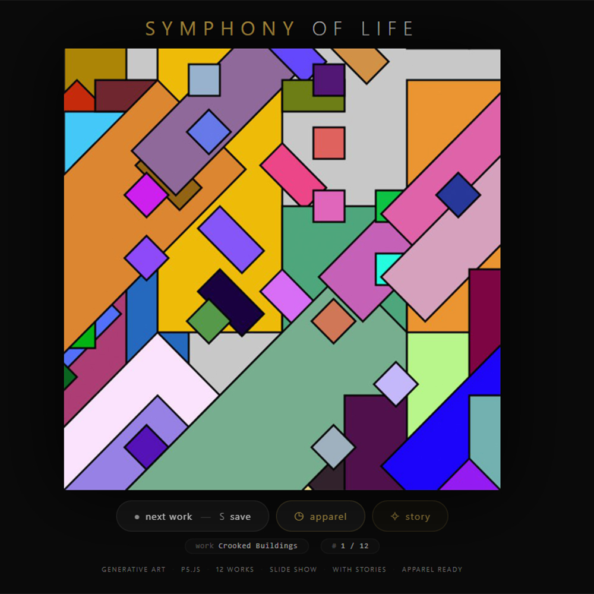
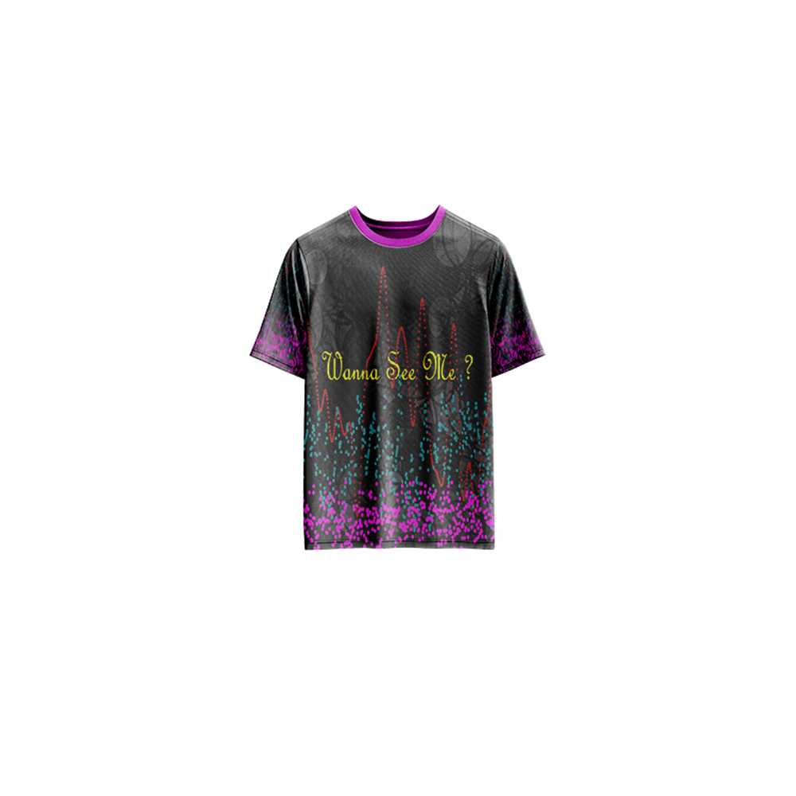

# Symphony of Life — Generative Art

[](https://reyrove.github.io/Symphony-of-Life-Generative-Art)
[](https://opensource.org/licenses/MIT)

> **Generative art meets storytelling.** A curated collection of 12 generative artworks with stories, exploring the symphony of life through geometric patterns, nature-inspired visuals, and animated narratives.

## 🎨 Live Demo

<div align="center">
  <a href="https://reyrove.github.io/Symphony-of-Life-Generative-Art" target="_blank">
    
  </a>
  <br><br>
  <a href="https://reyrove.github.io/Symphony-of-Life-Generative-Art" target="_blank">
    
  </a>
  <br>
  <em>Click the image or button to experience the generative art</em>
</div>

## 👕 Apparel Preview

<div align="center">
  
  <br>
  <em>Symphony of Life artwork printed on a T-shirt</em>
</div>

## ✨ Features

- **12 Unique Works** — A curated collection of generative art pieces
- **Storytelling** — Each artwork has its own narrative story
- **Animated GIFs** — Select artworks come to life with motion
- **Slideshow Navigation** — Browse through the collection
- **Save & Share** — Download any artwork as PNG
- **Apparel Mode** — Preview artwork on a T-shirt mockup
- **Responsive** — Works on desktop, tablet, and mobile
- **Keyboard Shortcuts**:
  - `→` or `N` — Next work
  - `←` or `P` — Previous work
  - `Space` — Next work
  - `S` — Save image
  - `A` — Toggle apparel
  - `C` — Toggle story

## 🎯 Artworks

| # | Title | Description |
|---|-------|-------------|
| I | **Crooked Buildings** | A geometric exploration of urban life, where random rectangles form crooked buildings in a symphony of colors. |
| II | **Sunset Serenade** | An animated serenade capturing the tranquil beauty of sunset, ocean waves, and peaceful reflections. *(GIF)* |
| III | **Tree's Silhouette** | A geometric tree formed by random triangles, exploring the meaning of life through nature's patterns. |
| IV | **Maya** | The story of a girl and an ancient oak tree, exploring life, growth, and the cycle of seasons. |
| V | **Azure's Journey** | A fish's journey beyond the surface, seeking the missing piece of its heart in a world of color. |
| VI | **Silent Dance** | A solitary oak's silent love affair with the sky, captured through branching trees and dramatic skies. |
| VII | **Whispers of the World** | An animated meditation on connection, where words and colors whisper stories of belonging. *(GIF)* |
| VIII | **Weavers of Destiny** | Two owls, Luna and Orion, weaving threads of fate in a tapestry of love and destiny. |
| IX | **Hexa's Legacy** | A mesmerizing hexagonal pattern exploring order, beauty, and the harmony of interconnected forms. |
| X | **Secret Labyrinth** | A journey through a forest labyrinth, discovering hidden patterns and finding the way home. |
| XI | **Polytopia** | A whimsical realm where shapes rule supreme, celebrating creativity and the joy of transformation. |
| XII | **Remy and Ollie** | The story of two blood cells on a journey through the body, discovering purpose and transformation. |

## 🚀 Quick Start

### Local Development

```bash
# Clone the repository
git clone https://github.com/reyrove/Symphony-of-Life-Generative-Art.git

# Navigate to the directory
cd Symphony-of-Life-Generative-Art

# Open in browser
open index.html
# or use a live server
```

### Deploy to GitHub Pages

1. Push to GitHub
2. Go to Settings → Pages
3. Select branch `main` and root folder
4. Your site will be live at `https://reyrove.github.io/Symphony-of-Life-Generative-Art`

## 🧠 How It Works

The collection features 12 generative artworks, each created with p5.js and creative coding techniques:

1. **Artwork Generation**:
   - Geometric shapes (circles, rectangles, triangles, hexagons)
   - Branching algorithms for trees and organic forms
   - Pattern generation for textile-like designs
   - Random color palettes and compositions

2. **Animation**:
   - Select artworks are animated using p5.js
   - Noise functions create organic motion
   - GIF export for animated pieces

3. **Storytelling**:
   - Each artwork has a narrative story
   - Stories are revealed in a beautiful modal
   - Roman numerals (I-XII) for chapter-like presentation

4. **Navigation**:
   - Smooth transitions between artworks
   - Keyboard shortcuts for easy browsing
   - Touch-friendly for mobile

## 📁 File Structure

```
Symphony-of-Life-Generative-Art/
├── index.html                  # Main application (all-in-one)
├── crooked-buildings.jpg       # Artwork 1
├── sunset-serenade.gif         # Artwork 2 (animated)
├── trees-silhouette.jpg        # Artwork 3
├── maya.jpg                    # Artwork 4
├── azures-journey.jpg          # Artwork 5
├── silent-dance.jpg            # Artwork 6
├── whispers-of-the-world.gif   # Artwork 7 (animated)
├── weavers-of-destiny.jpg      # Artwork 8
├── hexas-legacy.jpg            # Artwork 9
├── secret-labyrinth.jpg        # Artwork 10
├── polytopia.jpg               # Artwork 11
├── remy-and-ollie.jpg          # Artwork 12
├── Symphony-of-Life.jpg        # T-shirt mockup image
├── fav.svg                     # Favicon
├── demo-screenshot.jpg         # Website demo screenshot
├── README.md                   # This file
└── LICENSE                     # MIT License
```

## 🛠️ Tech Stack

- **Vanilla HTML/CSS/JS** — No dependencies
- **p5.js** — Generative art creation
- **p5.createloop** — Animation and GIF export
- **CSS Flexbox/Grid** — Responsive layout
- **GitHub Pages** — Hosting

## 🎯 Interactive Controls

| Action | Keyboard | Button |
|--------|----------|--------|
| Next Work | `→` or `N` or `Space` | Click "next work" |
| Previous Work | `←` or `P` | — |
| Save Image | `S` | Click "next work" |
| Toggle Apparel | `A` | Click "apparel" |
| Toggle Story | `C` | Click "story" |

## 🎨 Design Inspiration

The collection explores themes of:
- **Urban Life** — Crooked buildings and cityscapes
- **Nature** — Trees, forests, and organic forms
- **Transformation** — Growth, change, and renewal
- **Connection** — Between beings, worlds, and ideas
- **Patterns** — Geometric and natural patterns
- **Storytelling** — Visual narratives and emotions

## 📱 Responsive Design

The application automatically adapts to:
- Desktop screens
- Tablets
- Mobile phones
- Landscape orientation
- Various aspect ratios

## 🤝 Contributing

Contributions are welcome! Feel free to:
- Fork the repository
- Create a feature branch
- Submit a pull request

### Ideas for Contributions:
- Add more artworks
- New visual styles
- Enhanced storytelling features
- Performance optimizations

## 📄 License

MIT License — see [LICENSE](LICENSE) file for details.

## 🙏 Acknowledgments

- Created with p5.js
- Inspired by generative art and storytelling
- Special thanks to the creative coding community

---

**Built with ❤️ and the symphony of life**