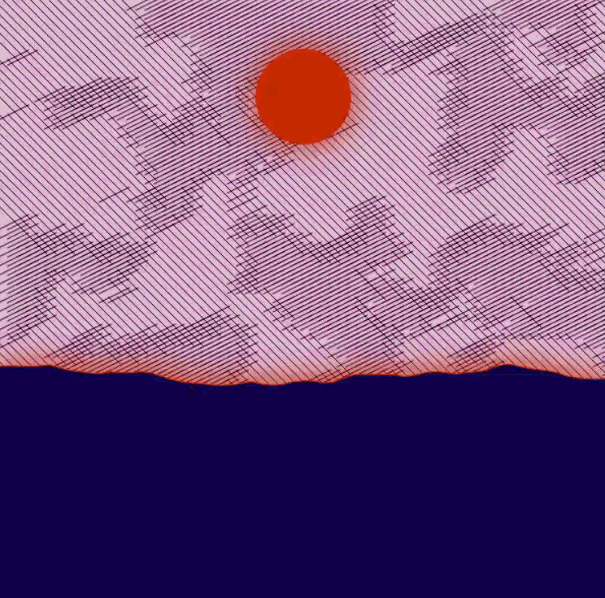

# Symphony-of-Life-Generative-Art

A collection page for **Symphony of Life** — fifteen works drawn with geometric primitives in p5.js, presented as a collection with a works grid, surfaces, process, and commission sections.

**Live:** `https://reyrove.github.io/Symphony-of-Life-Generative-Art/`

---

## Overview

**Symphony of Life** is a collection of fifteen works, each drawn with a small vocabulary of geometric primitives — **circles, rectangles, triangles, quads, bézier curves, arcs, and lines** — and accompanied by a written story. The works range from illustrative (a crow beside a human, a dance studio, a fish named Azure) to interior landscape (a figure under a perpetual black sky, a woman watching a sunset) to controlled abstraction (a 100 × 100 seed-based grid, a spiral inside a hexagon, horizontal bands emerging from distortion).

The collection is held together by the idea of **life** — the small recurring forms that shape a life, and the stories that give those forms meaning. Some works literally depict living things (trees, fish, owls, blood cells); others are about the shapes life takes as it moves through time.

The page functions as a **collection and licensing surface** for fashion houses, textile studios, and surface designers. All fifteen works are available to license individually or as a set.

---

## What Makes This Collection Different

**Symphony of Life** sits alongside the artist's other collections (Polar Memories, Wandering Eyes, Fibonacci's Spin, and the generative catalogue) but has a distinct character:

| Collection | Format | Character |
|-----------|--------|-----------|
| **Polar Memories** | Six mixed works | p5.Polar geometry, stills + GIFs |
| **Wandering Eyes** | Five mixed works | Geometric narrative, story-led |
| **Fibonacci's Spin** | Two fixed editions | Fibonacci orbit, animated GIFs |
| **Symphony of Life** | Fifteen mixed works | Geometric narrative + controlled abstraction |

Where **Wandering Eyes** focuses on the wandering gaze as a unifying gesture, **Symphony of Life** is broader — it is a small library of fables, each told in the same geometric language but with a different voice. Three of the fifteen works — **Matrix Rain 01**, **The Hextech Singularity**, and **VIOLET STRATA** — sit at the abstract end of the collection, contributing a more structural register to an otherwise narrative set.

---

## The Fifteen Works

### 01 / Crooked Buildings — still

> Amid the bustling crowd, I found solace in the charm of crooked buildings that seemed to speak a language of their own, a silent conversation with nature's hues.

**Primitives:** Rectangles · **Format:** JPG

### 02 / Sunset Serenade — animated

> In the symphony of life, as the sun bids adieu, a sunset serenade, painting skies anew. Ocean waves whisper in a tranquil rhyme, calm waters mirror a love that transcends time.

**Primitives:** Pattern · Noise · **Format:** GIF

### 03 / Tree's Silhouette — still

> Random triangles, a geometric spree, a tree's silhouette, nature's decree. Colors intertwine, a vibrant ballet, in the canvas of life, what role do I play?

**Primitives:** Triangles · Branch · **Format:** JPG

### 04 / Maya — still

> Maya, a wisp of a girl with eyes like moss, stood mesmerised by the ancient oak in her grandmother's garden. "Life is like a tree," Grandma Nila rasped.

**Primitives:** Branch lines · Colour · **Format:** JPG

### 05 / Azure's Journey — still

> Azure was unlike any other fish in the coral reef. While his scales shimmered the same vibrant blue, his heart harboured a curious sadness.

**Primitives:** Arcs · Reef shapes · **Format:** JPG

### 06 / Silent Dance — still

> In the heart of a sprawling meadow, stood a solitary oak, his branches reaching towards the heavens like gnarled fingers. Every evening, as the sun dipped below the horizon, the sky would transform into a breathtaking spectacle.

**Primitives:** Branch · Background pattern · **Format:** JPG

### 07 / Whispers of the World — animated

> The old woman sat by the window, the setting sun casting long shadows across her wrinkled face. "I wanna see you," she whispered. It wasn't about a physical presence, not anymore.

**Primitives:** Ellipses · Rectangles · Text · **Format:** GIF · p5.createloop

### 08 / Weavers of Destiny — still

> Beneath the watchful gaze of a star-dusted night sky, two owls, Luna and Orion, perched on a tangled mess of brightly coloured yarns. They weren't just owls; they were weavers of destiny.

**Primitives:** Bézier curves · Owl shapes · **Format:** JPG

### 09 / Hexa's Legacy — still

> In a world shrouded in cool, blue light, lived a lone inventor named Hexa. Their workshop hummed with the tireless whirring of gears. Hexa was obsessed with patterns.

**Primitives:** Hexagons · Motif class · **Format:** JPG

### 10 / Secret Labyrinth — still

> Ava squinted through the dense foliage, her heart hammering a frantic rhythm against her ribs. How long had she been lost? The forest, once a menacing labyrinth, now seemed to hold the secrets to her escape.

**Primitives:** Vertex shapes · **Format:** JPG

### 11 / Polytopia — still

> In the whimsical realm of Polytopia, where shapes ruled supreme, resided Pip, a circle unlike any other. Unlike his brethren content with simply rolling around, Pip yearned for a world brimming with fantastical forms.

**Primitives:** Rectangles · Triangles · Quads · **Format:** JPG

### 12 / Remy and Ollie — still

> In the ever-flowing river of the bloodstream, two blood cells, Remy and Ollie, bumped shoulders amidst the throng. "Easy there, newbie," Remy chuckled. Their journey was a wild ride through the grand symphony of life.

**Primitives:** Recursive branches · Ellipses · **Format:** JPG

### 13 / Matrix Rain 01 — still

> The first minted composition from Matrix Rain, a seed-based generative textile system by Reyrove. Built from a 100 × 100 computational grid, the system translates digital rain into structured visual fields designed to move between screen, textile, fashion, and physical surface.

**Seed:** 93242322 · **Grid:** 100 × 100 · **Edition:** 1/1 · **Year:** 2026

### 14 / The Hextech Singularity — still

> A study in the delicate balance between order and chaos. At its core lies a hypnotic spiral, representing infinite recursion and the origin point of data. This energy is contained within a perfect hexagon — a symbol of structure and balance — while chaotic neural pathways and geometric shards radiate outward into the void. A study in generative geometry, colour theory, and digital mysticism.

**Primitives:** Spiral · Hexagon · Shards · **Format:** JPG

### 15 / VIOLET STRATA — still

> A generative study of order emerging from controlled distortion. Horizontal bands, fragmented geometric forms, luminous colour fields, and a singular orbital form are woven into a synthetic landscape where structure gradually dissolves into movement. Generated through code, each composition emerges from a deterministic system of geometry, colour, noise, and spatial relationships.

**Primitives:** Bands · Orbital form · Noise · **Format:** JPG

---

## Features of the Collection Page

### Hero

A single square canvas displaying **Sunset Serenade** — the first animated work and the most representative of the collection's palette. Sunset colours, ocean motion, and the "Symphony" title tie it directly to the collection name.

### Works Grid

A **3-column grid** showing all fifteen works, each as a card with:

- A live preview (JPG or GIF) loaded from `/images/`
- The work title in Cormorant Garamond
- The story opening in DM Mono
- Two metadata rows: primitives, format

The 3 × 5 layout keeps the page compact while showing the full collection at a glance. On tablet the grid drops to 2 columns; on mobile to 1.

### Surfaces Section

Four representative works — **Sunset Serenade**, **Whispers of the World**, **Matrix Rain 01**, and **VIOLET STRATA** — are shown across four surfaces each:

- **Print** (1:1) — `background-size: contain`
- **Scarf** (3:1) — three repeats horizontally
- **Textile** (4:3) — 2×2 tile
- **Wall** (2:3) — two repeats vertically

The GIFs and JPGs are reused via CSS `background-image`, so the browser caches each file once and serves it to all tiles.

### Process Section

Three cards on the shared logic:

- **Geometric Vocabulary** — the small set of primitives
- **Each Work Has One** — the story-led approach
- **A Symphony of Forms** — the life motif that holds the collection together

### Commission Section

Collection-level licensing:

- **Collection licence** — all fifteen works together
- **Commission a work** — a new composition in the same vocabulary
- **Systems** — a private Symphony of Life tool for your studio

### Colophon

Standard footer with collection nav, works list (all fifteen), and studio contact.

---

## File Structure

```
Symphony-of-Life-Generative-Art/
├── index.html
├── README.md
└── images/
    ├── fav.svg
    ├── crooked-buildings.jpg
    ├── sunset-serenade.gif
    ├── trees-silhouette.jpg
    ├── maya.jpg
    ├── azures-journey.jpg
    ├── silent-dance.jpg
    ├── whispers-of-the-world.gif
    ├── weavers-of-destiny.jpg
    ├── hexas-legacy.jpg
    ├── secret-labyrinth.jpg
    ├── polytopia.jpg
    ├── remy-and-ollie.jpg
    ├── matrix-rain-01.jpg
    ├── hextech-singularity.jpg
    ├── violet-strata.jpg
    ├── tote.png
    ├── tee.png
    └── cushion.png
```

No build step. No dependencies. No JavaScript animation. The browser handles GIF playback and JPG display natively.

---

## Getting Started

1. Clone the repo:
   ```bash
   git clone https://github.com/reyrove/Symphony-of-Life-Generative-Art.git
   cd Symphony-of-Life-Generative-Art
   ```
2. Drop the fifteen work files into `images/` with the exact names above.
3. Add the three mockup PNGs (optional — they appear in the Commission section).
4. Open `index.html` in a browser.

That's it. The page loads all fifteen works and presents them in the collection layout.

---

## How the Page Is Organised

| Section | ID | Purpose |
|---------|-----|---------|
| Cover | — | Hero title + Sunset Serenade GIF |
| Statement | `#statement` | Artist statement about the collection |
| Works | `#works` | Fifteen work cards with story openings and metadata |
| Surfaces | `#surfaces` | Four works × four surfaces = 16 tiles |
| Process | `#process` | Three process cards on the shared logic |
| Commission | `#commission` | Collection licensing + mockups + CTA |
| Colophon | — | Footer, works list, studio links, legal modal |
| Legal modal | `#legalModal` | Licensing / Terms / Credits |

---

## Customisation

### Change the cover work

The cover currently shows **Sunset Serenade**. To feature a different work, edit the `src` in the cover ``:

```html
<div class="cover-art">
  
</div>
```

### Change the surfaces shown

The surfaces section shows four of the fifteen works. To show different works, edit the `background-image` URLs in the `<div class="surface-work-head">` + `<div class="surface-grid">` blocks.

### Change the works grid layout

The works grid uses CSS grid with `grid-template-columns: repeat(3, 1fr)`. Change to `1fr 1fr` for a two-column layout or `1fr` for a single column. With fifteen works, three columns produces a balanced 3 × 5 grid.

### Replace the mockups

Swap the three PNGs in `images/` or update the `src` attributes in the Commission section.

### Add a sixteenth work

Add a new `<article class="work-card">` block to the works grid and update the collection counts in the cover meta, statement, and colophon. The grid will reflow — a sixteenth work would leave one cell empty on the last row.

### Change the story openings

Each work card carries the opening one to three sentences of the story. Edit the `.work-card-desc` text. The full stories live on the individual work pages (see below).

---

## Individual Work Pages

The three abstract works at the end of the collection — **Matrix Rain 01**, **The Hextech Singularity**, and **VIOLET STRATA** — are each substantial enough to have their own repository and collection page, following the same pattern used by Fibonacci's Spin and Polar Memories. Suggested names:

| Work | Suggested repo |
|------|---------------|
| Matrix Rain 01 | `Matrix-Rain-01-Generative-Art` |
| The Hextech Singularity | `Hextech-Singularity-Generative-Art` |
| VIOLET STRATA | `Violet-Strata-Generative-Art` |

Each page would follow the same editorial template with a single-work hero, its own statement, surfaces, process, and commission section.

If you create these repos, the collection page's colophon "Works" column can be updated from `#` placeholders to real links.

---

## Design System

| Token | Value | Use |
|-------|-------|-----|
| `--bg` | `#0a0a0a` | Page background |
| `--bg-soft` | `#0f0f0e` | Statement / Commission background |
| `--paper` | `#f4f1ea` | Light surface (Surfaces section) |
| `--gold` | `#b8935a` | Primary accent |
| `--gold-soft` | `#d4b483` | Italic emphasis |
| `--serif` | Cormorant Garamond | Headings, titles |
| `--mono` | DM Mono | Labels, metadata, UI |

Type scale, spacing, and section rhythm match the artist's other collections. Responsive breakpoints at 900px, 720px, 560px, and 400px.

---

## Keyboard Shortcuts

| Key | Action |
|-----|--------|
| `Enter` / `Space` | Activate focused link or button |
| `Esc` | Close legal modal |

---

## Browser Support

Modern evergreen browsers with:

- Animated GIF support (universal)
- CSS custom properties (universal)
- `backdrop-filter` (Safari 9+, Chrome 76+, Firefox 103+)
- `aspect-ratio` CSS property (universal in modern browsers)

Fallback: the page works in any browser that can render an `` tag with a GIF or JPG.

---

## Accessibility

- All images have descriptive `alt` text
- Legal modal traps focus, closes on `Esc` and overlay click
- `prefers-reduced-motion` disables all transitions
- All interactive elements have visible focus states (via browser default)
- Ribbon nav scrolls horizontally on mobile with a gradient mask

---

## Deployment (GitHub Pages)

1. Push the repo to GitHub.
2. Go to **Settings → Pages**.
3. Under **Source**, select `Deploy from a branch`.
4. Choose branch `main` and folder `/ (root)`.
5. Save — the site goes live at `https://reyrove.github.io/Symphony-of-Life-Generative-Art/`.

---

## Notes on the Source

This page does not use p5.js. The fifteen works were originally drawn as p5.js sketches using geometric primitives; the outputs were captured as JPGs (for the stills) and GIFs (for the animated works), and are presented here as images.

**Why images rather than live sketches:**

- Images are lighter than continuous canvas redraws — the browser handles playback natively.
- The image files are cached after first load, so the surface tiles reuse the same files.
- The page has no external dependency beyond Google Fonts.

**One trade-off:** the GIF's frame rate is locked into the file. The two animated sketches originally ran at their own rates; the GIFs run at whatever rate was encoded.

---

## Related Repositories

| Repo | Theme |
|------|-------|
| [`Skyline-Series`](https://github.com/reyrove/Skyline-Series) | Themed cityscapes |
| [`Portrait-Series-Generative-Art`](https://github.com/reyrove/Portrait-Series-Generative-Art) | Generative faces |
| [`Girih-2-Generative-Art`](https://github.com/reyrove/Girih-2-Generative-Art) | Islamic geometric ornament |
| [`Gothic-Grid-Generative-Art`](https://github.com/reyrove/Gothic-Grid-Generative-Art) | Mosaic grid composition |
| [`Order-to-Chaos-Generative-Art`](https://github.com/reyrove/Order-to-Chaos-Generative-Art) | Gradient grid composition |
| [`Wallpaper-Groups-Generative-Art`](https://github.com/reyrove/Wallpaper-Groups-Generative-Art) | Crystallographic symmetry |
| [`Wandering-Tiles-Generative-Art`](https://github.com/reyrove/Wandering-Tiles-Generative-Art) | Line-drawing composition |
| [`Food-Grid-Generative-Art`](https://github.com/reyrove/Food-Grid-Generative-Art) | Illustrated food grid |
| [`Framed-Line-Generative-Art`](https://github.com/reyrove/Framed-Line-Generative-Art) | Gesture line composition |
| [`Deconstructed-Stage-Generative-Art`](https://github.com/reyrove/Deconstructed-Stage-Generative-Art) | Suprematist composition |
| [`Layered-Diagram-Generative-Art`](https://github.com/reyrove/Layered-Diagram-Generative-Art) | Layered linework composition |
| [`Japanese-Patterns-Generative-Art`](https://github.com/reyrove/Japanese-Patterns-Generative-Art) | Traditional motif composition |
| [`Matrix-Rain-Generative-Art`](https://github.com/reyrove/Matrix-Rain-Generative-Art) | Digital rain composition |
| [`Organic-Shapes-Generative-Art`](https://github.com/reyrove/Organic-Shapes-Generative-Art) | Layered petal-form composition |
| [`Recursive-Grid-Generative-Art`](https://github.com/reyrove/Recursive-Grid-Generative-Art) | Recursive subdivision composition |
| [`Generative-Lifeform-Generative-Art`](https://github.com/reyrove/Generative-Lifeform-Generative-Art) | Network / node-graph composition |
| [`Game-of-Seeds-Generative-Art`](https://github.com/reyrove/Game-of-Seeds-Generative-Art) | Cellular automaton composition |
| [`Fibonacci-Spin-Generative-Art`](https://github.com/reyrove/Fibonacci-Spin-Generative-Art) | Fibonacci orbit collection |
| [`Polar-Memories-Generative-Art`](https://github.com/reyrove/Polar-Memories-Generative-Art) | p5.Polar collection |
| [`Wandering-Eyes-Generative-Art`](https://github.com/reyrove/Wandering-Eyes-Generative-Art) | Geometric narrative collection |
| **`Symphony-of-Life-Generative-Art`** | Geometric narrative + abstraction collection *(this repo)* |

All twenty share the same catalogue template, design tokens, and editorial register.

---

## Credits

- **Design & Code** — Reyhaneh Daneshdoost (Reyrove)
- **Typefaces** — Cormorant Garamond, DM Mono
- **Engine** — p5.js · p5.createloop · Generative geometry
- **Collection** — Symphony of Life, Autumn 2026
- **Works** — Crooked Buildings · Sunset Serenade · Tree's Silhouette · Maya · Azure's Journey · Silent Dance · Whispers of the World · Weavers of Destiny · Hexa's Legacy · Secret Labyrinth · Polytopia · Remy and Ollie · Matrix Rain 01 · The Hextech Singularity · VIOLET STRATA

---

## License

All artwork, code, and motion systems are the intellectual property of the artist. Works may not be reproduced, redistributed, resold, or adapted without a written licence.

© 2026 Reyrove. All rights reserved.

For licensing, commissions, or private systems: **reyhanehdaneshdoost@gmail.com**